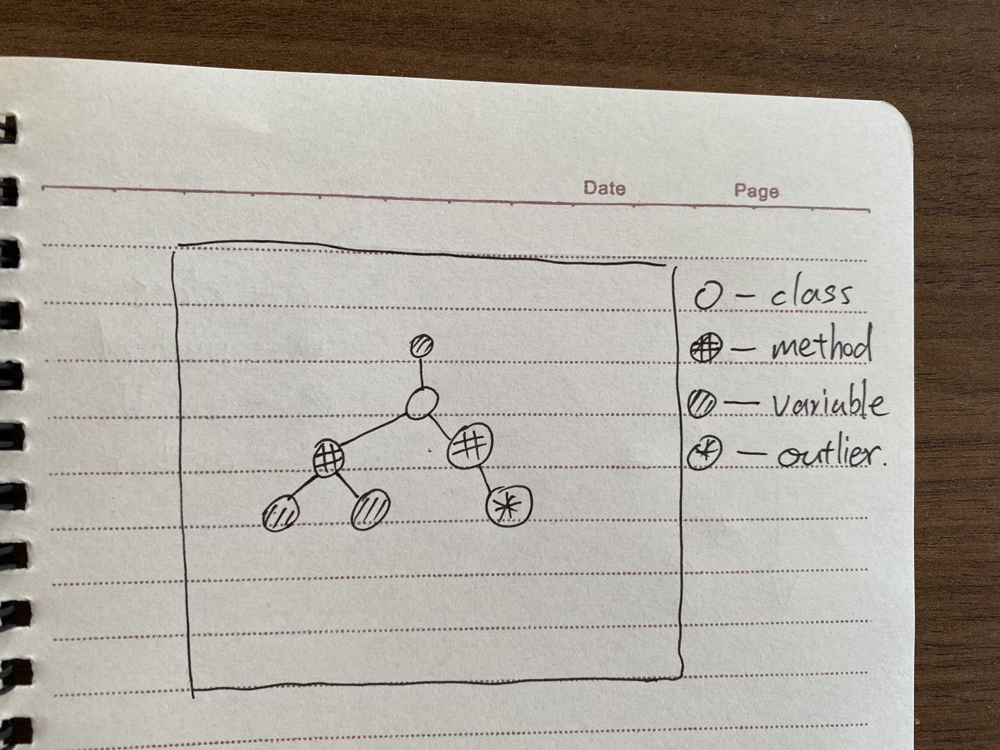
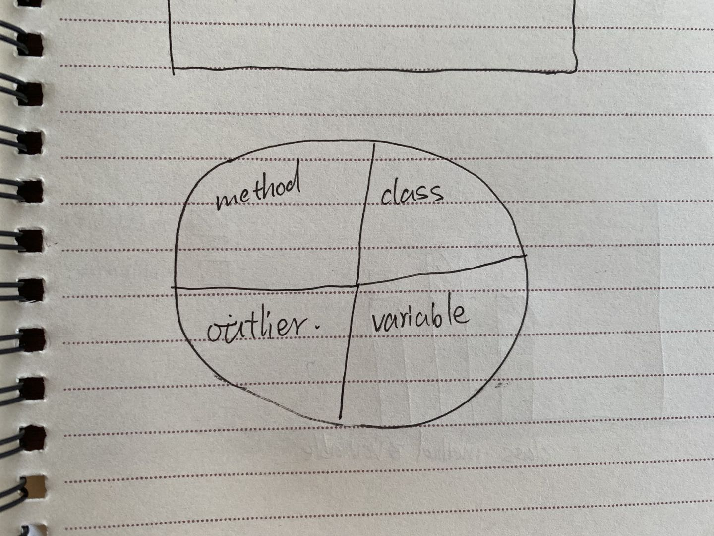
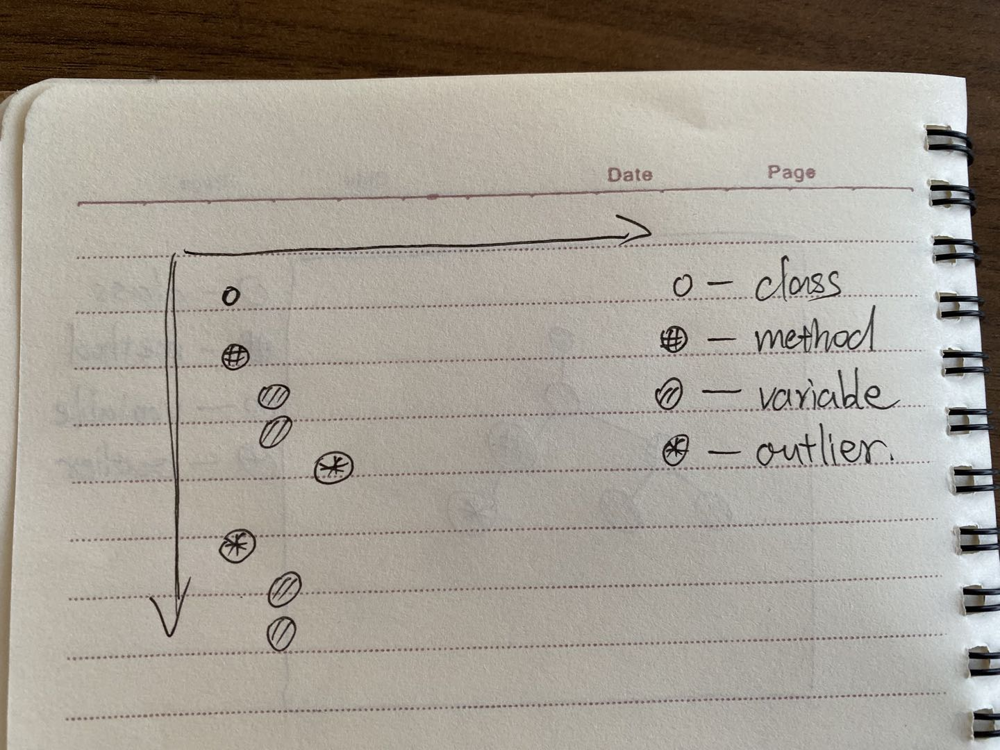
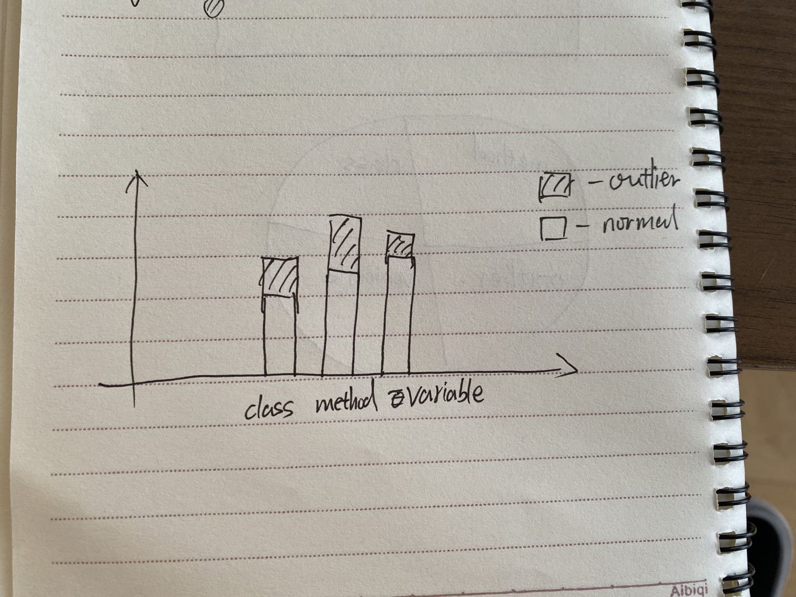
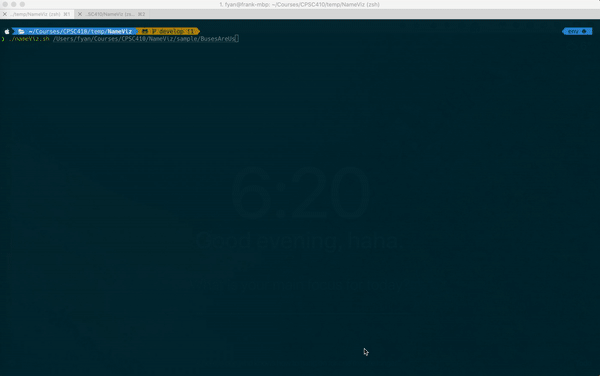

# NameViz

This is the project to help the user analysis the name in java project for variables, class and so on, and provide a visualization to find out the outlier which violates the naming conventions.

## Desgin

### [First Design doc](https://docs.google.com/document/d/1hWxpEQqI-LhiZdUcbBOHfuQPMWn3_As5hJdQ9lsX3_Y/edit)

Goal:
* help programmers evaluate the consistency of their naming conventions according to their type: class name, function name, and variable name. Programmers can find outliers, which are names that do not match the convention for their type.


Data structure:
```json
[
  {
    "fileName": ,
    "filePath": ,
    "isOutlier": ,
    "errorMessage": ,
    "line": ,
    "name": ,
    "parent": ,
    "position": ,
    "subNames": [],
    "type": ,
    "variableType": 
  },

]
```

Visualization:
* summary table


### Second desgin

In second iteration of desgin after prototype user study, we mainly improve our visualization, we add more ways to help the user easily find out the oulier.

Visualization:
* node-link graph 
* pie chart 
* scatter plot 
* bar chart 

## Detail

* [Analysis]()
* [Visualization](./visulization/README.md)

# Setup

Requirement:

* Python 3.7.5
* All packages in `requirements.txt`

## Usage

### script

we provide a smiple script to run our tool, which would do analysis first and then visualize in web page.

## command

```
./nameViz.sh [file path to target project folder]
```

## Demo




## Work

This part shows each member response to which part of project.
David: Write regex and algorithm that search different kinds of names from java file

### Analysis

* David Chen
* Jude Sidloski
* Ivan Zhang
  * Research resource of accuracy of WordNet words bank.
  * Using regex and WordNet to analysis each word in a name to check if the word match correct pattern of Java naming convention.
  * Test with different name and name type combinations.
  * Combine outlier result to output.

### Visualization

* Estella Wang
* Frank Yan
  * build outer frame for visualization
  * mainly worked on implementation of node graph, pie chart and scatter plot.
  * add simple filiter allow users to foucus on part of project thery want to do visualization.

